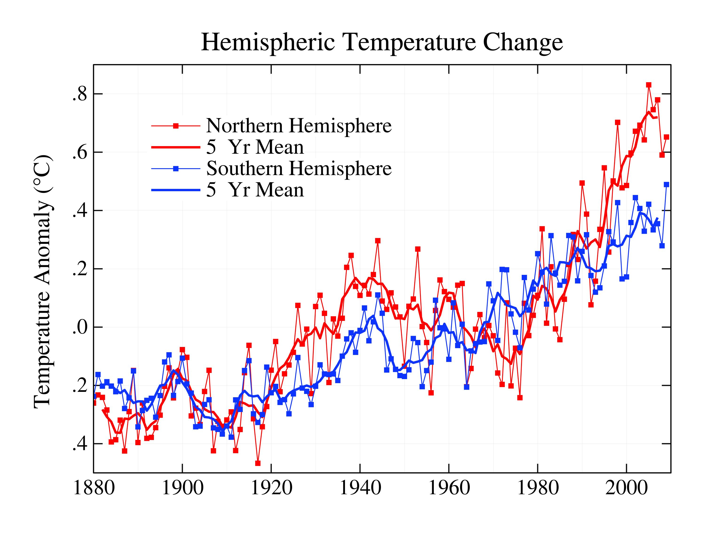
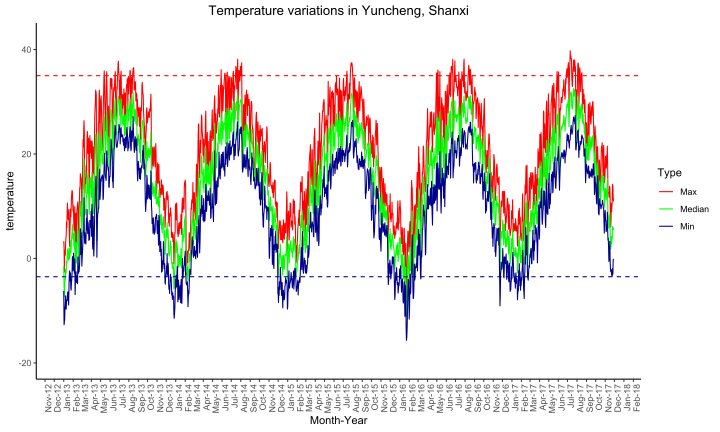
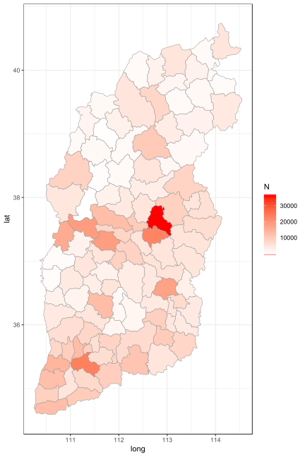
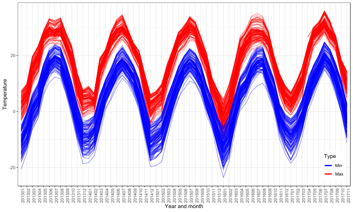
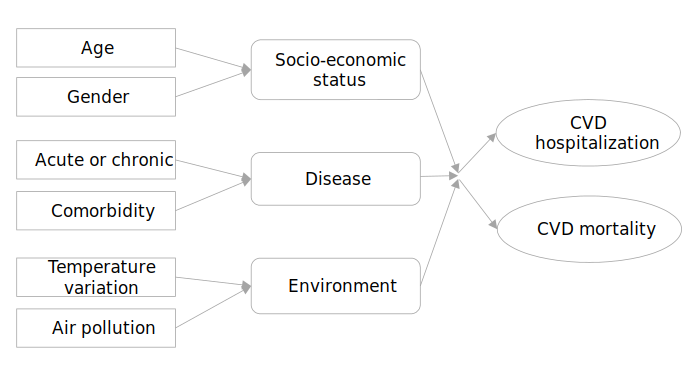

```{r setup, include=FALSE}
options(htmltools.dir.version = FALSE)
```


# Background

.font130[
- CVD is the leading cause of death worldwide in 2016
- long time exposure in extreme temperature
- a more comprehensive understanding on the effect of temperature variation

**Overall goal: ** to explore the association between temperature variation and the outcomes of CVD patients in Shanxi, China 

**The long-term goal** to reduce CVD hospitalizations and mortality due to weather changes in China
]


---

# Aims

#### 1. Determine the association between temperature variation and the hospitalization rates of chronic CVD patients

.font120[
**Hypothesis: ** more regional temperature variation is associated with a higher rate of chronic CVD hospitalizations
]

#### 2. Examine the association between temperature variation and the mortality of chronic CVD patients

.font120[
**Hypothesis: ** temperature variation is independently associated with patients’ in-hospital mortality after adjusting for the covariates.
]
---

# Significance

.font150[
- CVD is the leading cause of death worldwide and in China
- Dramatic weather changes and human activities
- Little evidence exists on the association between temperature variation and CVD outcomes
]

.pull-left.center[

<figcaption>Figure 1 CVD disease burden</figcaption>
]
.pull-right.bottom[

<figcaption>Figure 2 Global temperature pattern </figcaption>
]
---

# Innovation

- A generally overlooked area
- A decomposition of temperature variation into vertical and horizontal variation
- Bayesian statistical models
- 127 regions or districts in a populous province

.center[

<figcaption>Figure 3 Temperature variation in Yucheng, Shanxi </figcaption>]


---

class: center, middle, inverse

# Approach

<html><div style='float:left'></div><hr color='#EB811B' size=1px width=720px></html> 

---

# The Shanxi Chinese population

.pull-left[
.font120[
- Large sample size: </br> __36 million__ residents, __1.2 million__ CVD inpatients
- very different temperature patterns
- long observation window: </br>year 2013 to 2017 
- regional variation: </br> __127 districts or counties__
        ]
          ]


.pull-right.left[
  
  <figcaption>Figure 4 Patient volume distribution </br> in 127 cities or counties</figcaption>
]


---

# Different temperature patterns

- Average temperature difference within a day is **12 Celsius degrees**
- Average temperature difference between summer and winter is **28.1 Celsius degrees**

.center[

<figcaption>Figure 5 Temperature variation across 127 counties and districts</figcaption>
]

---

# Data

## The Shanxi hospitalized patient Database

- All patients hospitalized in secondary and tertiary hospitals

+ socio-demographic status (age, sex, marital status, occupation)
+ admission and discharge status
+ up to 10 secondary ICD-10 diagnosis codes
+ outcome upon discharge

## China Meteorological Database

- Maximum temperature, 
- Average temperature,
- Minimum temperature, 
- Wind speed, 
- Humidity,
- Air quality index (AQI): $SO_2$, $NO_2$, $pm10$, $pm2.5$, $CO$, and $O_3$. 

---


# Conceptual framework

.center[

<figcaption>Figure 6 Conceptual framework</figcaption>
]


---

# Statistical analysis - Aim 1

\begin{align*}
Y_{jt} & \sim \text{POI}(Pop_{jt}*\lambda_{jt})\\
\log(\lambda_{jt}) & = \beta_{0j} + \beta_{1j}HV_{jt}+ \beta_{2j}VV_{jt} + \beta_{3}Tem_{jt} + \beta_{4}Old_{jt} \\
& + \beta_{5}Edu_{jt} + \beta_{6}Air_{jt} + \beta_{7}Season_{jt}\\
\beta_{0j} & \sim N(\mu_0, \sigma_0)\\
\beta_{1j} & \sim N(\mu_1, \sigma_1)\\
\beta_{2j} & \sim N(\mu_2, \sigma_2)
\end{align*}

- $j$: index for region (districts/counties)
- $t$: a certain time during 2013 and 2017
- $Y_{jt}$: total number of CVD hospitalization in district $j$, time $t$
- $Pop_{jt}$: total number of population
- $HV_{jt}$: Horizontal temperature variation
- $VV_{jt}$: Vertical temperature variation
- $Tem_{jt}$: Average temperature at that time


---

# Statistical analysis - Aim 2


\begin{align*}
D_{ijt} & \sim \text{POI}(\theta_{ijt})\\
\text{logit}(\theta_{ijt}) & = \beta_{0j} + \beta_{1j}HV_{jt}+ \beta_{2j}VV_{jt} + \beta_{3}Tem_{jt} + \beta_{4}Age_{i} + \beta_{5}Gender_{jt}  \\ 
& +\beta_{6}Occupation_{i} + \beta_{7}Comorbidity_{i} + \beta_{8}Gravity_{i} + \beta_{9}Season_{jt}\\
\beta_{0j} & \sim N(\mu_0, \sigma_0)\\
\beta_{1j} & \sim N(\mu_1, \sigma_1)\\
\beta_{2j} & \sim N(\mu_2, \sigma_2)
\end{align*}


- $j$: index for patient
- $D_{ijt}$: Whether patient $i$ died during hospitalization or not,
- $\theta_{ijt}$: The probability of in-hospital death for patient $i$,
- $Gravity_{i}$: Gravity of disease.


---

# Estimation method

.font150[
- Stan: Hamiltonian Markov chain Monte Carlo
- Non-informative priors
- 3000 burn-in
- 7000 simulations per chain
- 4 chains
- Gelman-Rubin statistics and posterior convergence checks
]

.center[


]


---

# Potential Problems and Solutions

##### Incomplete air pollution data 

- Air pollution data prior to 2015 may be missing.
- separate analysis for complete and non-complete air pollution data

##### Non-convergence for the Bayesian models 

- Non-convergence due to large sample size
- Frequentist methods or firefly MCMC (subsampling)

##### Missing data 

- missing completely at random (MCAR) - exclude these missing cases
- missing at random (MAR) - analysis based on the complete sample

##### Adjacency of regions

- Bayesian Gaussian model 
- geographically weighted regression 


---

class: center, middle, inverse

# Questions and Answers


